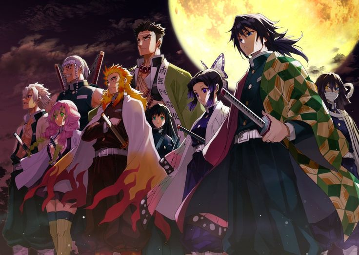

# Demon Slayer Quiz

Welcome to the **Demon Slayer Quiz**! This interactive quiz allows users to discover which Demon Slayer Hashira they are most like based on their answers to a series of fun and engaging questions.

## Features

- **Interactive Quiz**: Users can answer 12 questions to find out which Hashira they resemble.
- **Responsive Design**: The quiz is designed to be mobile-friendly and accessible on various devices.
- **Dynamic Scoring**: Each answer contributes to a score that determines the user's Hashira.
- **User  Input**: Users can enter their name to personalize their quiz experience.
- **Engaging UI**: The quiz features a visually appealing layout with radio buttons for easy selection.

## Technologies Used

- **HTML**: For the structure of the web page.
- **CSS**: For styling and layout.
- **JavaScript**: For interactivity and quiz logic.
- **Audio**: Background music to enhance the user experience.

## Contributing

Contributions are welcome! If you have any ideas for improvements, open an issue or create a pull request.

## Credits
Created by:

 

Under the guidance of:

               

## Developer:
Kanika Chauhan

## Contacts:

